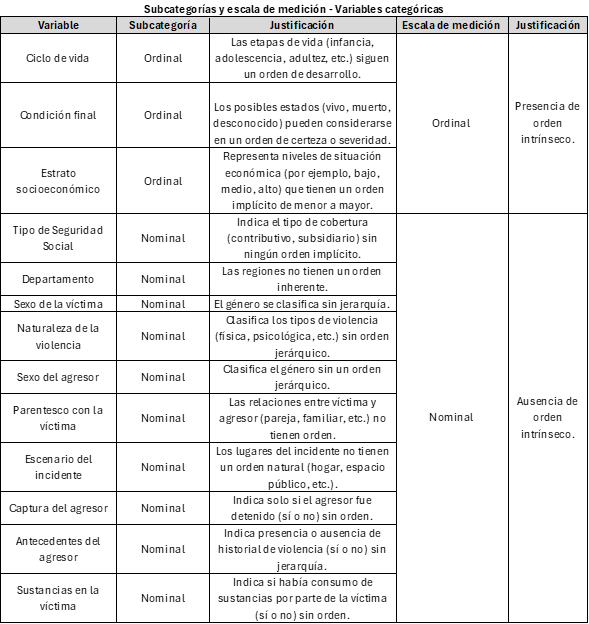

# Relevancia temática y objetivos de estudio 

La violencia de género, entendida como cualquier acto que cause daño físico, psicológico o sexual a una persona debido a su género, representa una de las problemáticas más urgentes y complejas a nivel mundial, pues este tipo de violencia, que abarca abusos físicos, psicológicos, sexuales y económicos, está profundamente ligado a las desigualdades de poder y los estereotipos de género en la sociedad, perpetuando ciclos de sufrimiento y exclusión para quienes la padecen[@onu2023violencia]. Según la Organización Mundial de la Salud (OMS), aproximadamente una de cada tres mujeres, o el 30%, ha sufrido violencia física o sexual por parte de su pareja en algún momento de su vida, lo que subraya la gravedad de esta crisis en términos de salud pública y derechos humanos [@onu2021violencia].

En América Latina, la situación es igualmente alarmante. La Comisión Económica para América Latina y el Caribe (CEPAL) informó que en 2022 al menos 4.050 mujeres fueron víctimas de femicidio o feminicidio en 26 países y territorios de la región, lo que equivale a una mujer asesinada por razones de género cada dos horas [@cepal2023femicidio]. Aunque la violencia de género afecta desproporcionadamente a las mujeres, los hombres también son víctimas, especialmente en contextos intrafamiliares; sin embargo, estos casos suelen recibir menos visibilidad y atención en los estudios y políticas[@ins2021violencia]. 

En Colombia, la violencia de género es considerada una de las mayores preocupaciones en términos de salud pública y desarrollo social. Según el Instituto Nacional de Medicina Legal y Ciencias Forenses, en 2021 se registraron 116.302 casos de violencia de género e intrafamiliar, de estos, el 79,1% (92.020 casos) correspondieron a mujeres, mientras que el 20,9% (24.282 casos) correspondieron a hombres [@ins2021violencia]. Estas cifras evidencian que, aunque la violencia de género afecta principalmente a mujeres, no es exclusiva de ellas, y afecta también a una proporción significativa de hombres, lo que resalta la necesidad de un enfoque inclusivo y amplio para abordar esta problemática.

Además de causar sufrimiento directo a las víctimas, la violencia de género genera efectos profundos en el conjunto de la sociedad, tanto en términos económicos como sociales. Según el Banco Interamericano de Desarrollo (BID), el impacto económico de la violencia de género en América Latina alcanza hasta el 3.44%  del PIB de la región, debido a los elevados costos en servicios de salud, justicia y la pérdida de productividad asociada a las secuelas de esta violencia [@bid2024costos]. En Colombia, estos efectos se ven agravados por factores como el conflicto armado, la desigualdad económica y los estereotipos de género, que incrementan la prevalencia de la violencia de género en sus diversas manifestaciones, según señala el Ministerio de Salud y Protección Social [@cepal2020brechas]. 

Por tanto, para abordar de manera integral la violencia de género en Colombia y desarrollar intervenciones efectivas, es fundamental basarse en un análisis detallado de los datos disponibles. En este contexto, el presente estudio se centra en el análisis de los datos sobre violencia de género en Colombia entre 2015 y 2023, con el objetivo general de **identificar los perfiles de riesgo de víctimas y agresores, así como los factores situacionales asociados a la violencia de género e intrafamiliar en el país, para comprender los patrones demográficos y contextuales que aumentan la probabilidad de estos incidentes**. A través de este estudio, se plantea responder a la pregunta de investigación: ¿Cuáles son los perfiles de riesgo demográficos y situacionales asociados a las víctimas y agresores en los casos de violencia de género en Colombia entre 2015 y 2023? Para responder a esta cuestión, se establecen los siguientes objetivos específicos:

  **-** Identificar los perfiles de riesgo sociodemográficos de las víctimas de violencia de género en Colombia, evaluando factores como edad, sexo, ciclo de vida y otros elementos que indiquen los grupos más vulnerables.

  **-** Definir los perfiles de riesgo de los agresores, analizando edad, sexo, ciclo de vida, parentesco con la víctima, antecedentes de violencia y estado de captura.
  
  **-** Examinar factores situacionales de los incidentes, como el lugar y la influencia del consumo de sustancias en las víctimas, para identificar entornos y circunstancias de mayor riesgo.

```{r setup, include=FALSE}
##Proyecto de estadística 3
##Leer Csv
library(ggplot2)
library(sf)
library(dplyr)
library(readxl)
library(fdth)
library(plotly)
library(qcc)
library(readr)
library(leaflet)
library(htmltools)
library(DT)
library (modeest)
library(moments)
library(explore)
library(lessR)

violencia_genero <- read_csv("Base_Violencia.csv")
knitr::opts_chunk$set(echo = TRUE)  
```
```{css,echo=FALSE}
.column {display:flex;}
h1{color:rgb(26, 72, 112)}
h2{color:rgb(26, 72, 112)}
h3{color:rgb(26, 72, 112)}
```

# Descripción técnica del dataset y contextualización

Este estudio utiliza una base de datos robusta y detallada sobre violencia de género en Colombia, abarcando incidentes registrados semanalmente entre enero de 2015 y marzo de 2023. Esta base de datos tomada de datos abiertos Colombia, con 12,193 registros y 32 variables en su versión original, constituye un recurso invaluable para el análisis de un fenómeno de alta complejidad social y relevancia, permitiendo investigar en profundidad los factores demográficos, socioeconómicos y contextuales asociados a los incidentes de violencia de género. La amplitud y riqueza de las variables, que incluyen características detalladas de víctimas y agresores, la relación entre ambos, y las circunstancias específicas de cada evento, aportan una perspectiva integral sobre los perfiles y patrones subyacentes en estos casos [@secretaria2024violencia]. Sin embargo, algunas variables de la base de datos original son redundantes, otras tienen bajo valor explicativo para identificar patrones de violencia o perfiles de riesgo, algunas columnas se encuentran incompletas y algunas contienen datos administrativos o contextuales que no contribuyen de manera significativa al análisis de la violencia de género. 

Por ende, para maximizar la relevancia y aplicabilidad de la base de datos en el contexto de los objetivos y preguntas de investigación, se realizó una depuración exhaustiva de las variables. Este proceso implicó la eliminación de columnas redundantes y de baja contribución analítica, preservando solo aquellas que resultan críticas para el análisis. Además, se transformaron codificaciones complejas en etiquetas descriptivas, mejorando así la accesibilidad y claridad interpretativa de los datos. El conjunto depurado, compuesto ahora por 12,193 registros y 19 variables clave, se centra en la información esencial que permite una exploración precisa de patrones, factores de riesgo, y contextos de violencia en los distintos incidentes registrados. 

A continuación se exponen las variables a estudiar de la base de datos modificada, las cuales se configuran como parámetros bajo estudio  bajo estudio que capturan una gama de aspectos de los individuos y las circunstancias que rodean cada incidente de violencia de género, permitiendo explorar temas como los perfiles sociodemográficos de víctimas y agresores:

```{r}
names(violencia_genero) #Nombre de las columnas y por tanto de las variables
```

Por otro lado, como bien se mencionó, el conjunto de datos actual cuenta con 12,193 filas, que corresponden al total de observaciones o unidades experimentales en el dataset. Cada fila representa una unidad experimental, es decir, un incidente específico de violencia de género o intrafamiliar, documentado con datos detallados en cada una de las 19 variables, lo que permite construir un perfil exhaustivo que incluye características demográficas de la víctima y el agresor, el contexto del incidente y otros factores relevantes. Con 12,193 unidades experimentales y 19 variables, el conjunto de datos contiene un total de 195,088 entradas, lo cual habilita un análisis estadístico tanto descriptivo como inferencial sobre los patrones y factores asociados a la violencia de género.

```{r}
num_rows <- nrow(violencia_genero) #Número de observaciones (filas)
num_colums <- ncol(violencia_genero) #Número de variables (columnas)
total_values <- num_rows*num_colums #Total de datos 

num_rows
num_colums
total_values
```

## Clasificación de variables

Para un análisis descriptivo adecuado, es crucial clasificar las variables en función de su tipo. En esta base de datos sobre violencia de género, se distinguen variables categóricas y numéricas, lo cual facilita la elección de métodos analíticos específicos. Las variables categóricas se analizan mediante distribuciones de frecuencia en aspectos como género, parentesco y escenario del incidente. Las variables numéricas, en cambio, se describen usando medidas de tendencia central y dispersión (media, mediana, desviación estándar), lo que ayuda a identificar patrones en la edad de los involucrados. Esta clasificación asegura la precisión en la descripción de características y patrones en los datos.

### Variables Categóricas

Son esenciales para comprender los perfiles y contextos específicos de cada incidente de violencia. En este conjunto de datos, estas variables se centran en características de ubicación, relación, y condiciones de los involucrados y el incidente. 

  - **Departamento:**: es una **etiqueta geográfica** que identifica la ubicación de cada incidente, permitiendo analizar patrones regionales de violencia y enfocar recursos en áreas con mayor incidencia.

  - **Ciclo de vida**: representa una **categoría de etapa de vida** que indica la etapa de vida de la víctima (infancia, adolescencia, adultez), ayudando a entender cómo varía el riesgo de violencia según la edad y desarrollo.
  
  - **Sexo de la víctima**: es una **categoría de género** que identifica si la víctima es masculina o femenina, es clave para analizar a distribución y dinámica de la violencia entre géneros.
  
  - **Estrato socioeconómico**:  **etiquetas para diferentes niveles socioeconómicos** (bajo, medio, alto, etc.) que permite analizar cómo el contexto económico afecta la vulnerabilidad y el riesgo de las víctimas de violencia.
  
  - **Tipo de Seguridad Social **: Indica el sistema de cobertura (público o privado) de la víctima, lo cual ayuda a entender el acceso a recursos de atención y calidad de respuesta.
  
  - **Condición final**: Describe el estado de la víctima tras el incidente ("vivo", "muerto", "desconocido"), permitiendo evaluar el riesgo de mortalidad y limitaciones en el seguimiento de casos.
  
  - **Naturaleza de la violencia**:  Clasifica el tipo de violencia (física, psicológica, sexual), fundamental para entender las formas más comunes de agresión.
  
  - **Sexo del agresor**:  es una categoría de género para el agresor (masculino, femenino,intersexual), la cual permite observar los patrones de agresión según el género del agresor, proporcionando datos útiles para estrategias de prevención y perfilamiento.
  
  - **Parentesco con la víctima**: es una **categoría de relación** que define el tipo de vínculo entre la víctima y el agresor (pareja, familiar, desconocido)lo cual permite entender cómo los lazos familiares o cercanos pueden influir en la dinámica de la violencia, aspecto crucial para entender los contextos en los que ocurre.
  
  - **Escenario del incidente**: describe el **contexto físico** del incidente (hogar, espacio público), la cual permite identificar los lugares más comunes donde ocurre la violencia, lo que es importante para desarrollar estrategias de prevención y seguridad adaptadas a esos entornos.
  
  - **Captura del agresor**:  es un **indicador legal** que señala si el agresor fue detenido tras el incidente (sí, no o desconocido), el cual es relevante para evaluar la respuesta institucional frente a los casos de violencia, permitiendo analizar la efectividad y rapidez de las intervenciones legales.
  
  - **Antecedentes del agresor**:  es un **historial de comportamiento** que muestra si el agresor tenía un historial previo de violencia, útil para entender patrones de reincidencia, contribuyendo a la identificación de perfiles de riesgo.
  
  - **Sustancias en la víctima**:  Sustancias en la víctima es una variable cualitativa que actúa como un **indicador binario de influencia de sustancias** en la víctima al momento del incidente, lo cual ayuda a explorar la relación entre consumo y violencia, aportando al perfil de riesgo.

### Variables Cuantitativas

  - **Año**: es una **dimensión temporal** que indica el año en que ocurrió el incidente. Al tratarse de un valor numérico, permite analizar la evolución de los casos a lo largo del tiempo y detectar tendencias en la frecuencia de los incidentes de violencia.
  
  - **Edad de la víctima**: es una **medida de edad** numérica que permite analizar patrones de violencia según los diferentes grupos de edad de las víctimas. Esta variable es esencial para identificar los rangos etarios más vulnerables y orientar las intervenciones preventivas.
  
  - **Edad del agresor**: también es una **medida de edad** numérica, en este caso del agresor, y es útil para observar patrones de agresión en función de la edad del agresor. Este análisis contribuye a la identificación de perfiles etarios específicos asociados a comportamientos violentos.
  

## Subclasificación de variables y escalas de medición

Si bien las variables se clasifican principalmente en cualitativas y cuantitativas, estás también se pueden dividir en subcategorías dependiendo si son numéricas o categóricas y, además, pueden adaptar diversas escalas de medición. A continuación, se presentan 2 tablas que resumen esta información. 

### Variables Categóricas

<center>

{width=700}
</center>


Las variables categóricas en este conjunto de datos se dividen en nominales y ordinales, cada una con un rol en el análisis de violencia de género. Las variables nominales ("Departamento", "Sexo de la víctima", "Tipo de Seguridad Social", "Escenario del incidente") permiten agrupar datos sin un orden específico, siendo clave para observar patrones de distribución geográfica, género y contextos de los incidentes mediante análisis de frecuencia. En cambio, las variables ordinales ("Ciclo de vida", "Estrato socioeconómico", "Condición final") tienen un orden implícito que permite jerarquizar categorías, facilitando el análisis de tendencias y la relación entre el nivel socioeconómico o la etapa de vida y la vulnerabilidad ante la violencia. Distinguir entre nominales y ordinales es crucial para aplicar análisis estadísticos adecuados y obtener conclusiones significativas sobre los perfiles de riesgo en violencia de género.


### Variables Cuantitativas

<center>
{width=700}

</center>


Las variables cuantitativas en este conjunto son discretas y útiles para analizar patrones temporales y demográficos. La Edad de la víctima y Edad del agresor se miden en años enteros en una escala de razón, permitiendo comparaciones proporcionales (por ejemplo, una persona de 40 años es el doble de mayor que alguien de 20), lo que ayuda a identificar patrones de edad en violencia. La variable Año también es discreta, pero en una escala de intervalo. Esto permite observar cambios a lo largo del tiempo, aunque sin un "cero absoluto" de tiempo, útil para analizar tendencias anuales en la violencia de género. Distinguir entre escala de razón y de intervalo permite aplicar técnicas analíticas precisas: edad para análisis proporcionales y año para estudiar patrones temporales, proporcionando una visión completa de los factores de riesgo en violencia de género.

# Bibliografía
